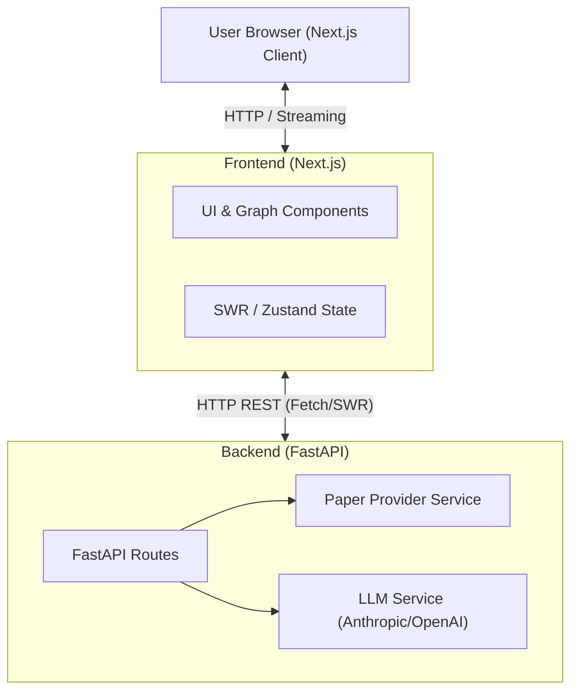

# connect.ai — Implementation Plan

A research paper graph explorer similar to Connected Papers, with better UI and native AI support for concept evolution tracking.

## Core Features

1. **Citation Graph** — interactive force-directed graph of papers and their citation relationships
2. **AI Paper Analysis** — Claude extracts key concepts and generates summaries for each paper
3. **Concept Evolution Tracking** — see how a concept is introduced, refined, challenged, or extended across papers over time
4. **AI Chat** — ask natural language questions about the visible graph
5. **Concept Explorer** — standalone view to browse a concept's timeline across the literature

---

## Tech Stack

| Layer | Choice | Reason |
|---|---|---|
| Frontend Framework | Next.js 14 (App Router) | Client-side UI, RSC, React Flow integration |
| Backend Framework | FastAPI (Python) | Robust API development, Python ecosystem access |
| Language | TypeScript (Frontend), Python (Backend) | Type safety across layers |
| Styling | Tailwind CSS + shadcn/ui | Dark-mode-native, Radix-based, copy-owned components |
| Graph | React Flow | Purpose-built for node/edge graphs, declarative API, handles zoom/pan/drag |
| AI Integration | Claude / OpenAI via Python SDKs | LangChain/LlamaIndex access in backend if needed |
| Data Validation | Zod (Frontend), Pydantic (Backend) | Input/output validation |
| Data | Abstracted Paper Provider API | Agnostic of backend (e.g., Semantic Scholar, OpenAlex, Crossref) |
| Fetching | SWR (Frontend), httpx (Backend) | Deduplication, caching, concurrent API requests |
| State | Zustand | Minimal, no Provider boilerplate |
| Theme | next-themes | No flash on dark mode |
| Colors | d3-scale + d3-color | Year-to-color gradient without pulling all of D3 |
| Animations | framer-motion | Panel transitions, staggered graph entrance |
| Cache | Redis / local LRU | Server-side cache for paper data and AI results |

---

## File Structure

```
connect.ai/
├── frontend/                         # Next.js App
│   ├── src/
│   │   ├── app/
│   │   │   ├── layout.tsx                # Root layout: fonts, ThemeProvider
│   │   │   ├── page.tsx                  # Home / search screen
│   │   │   ├── globals.css
│   │   │   ├── graph/
│   │   │   │   └── [paperId]/
│   │   │   │       └── page.tsx          # Graph view for a seed paper
│   │   │   └── concepts/
│   │   │       └── page.tsx              # Concept explorer screen
│   │   │
│   │   ├── components/
│   │   │   ├── ui/                       # shadcn/ui primitives (auto-generated)
│   │   │   ├── search/
│   │   │   │   └── UrlInput.tsx          # Input for URL/DOI submission
│   │   │   ├── graph/
│   │   │   │   ├── GraphCanvas.tsx       # React Flow canvas (core)
│   │   │   │   ├── PaperNode.tsx         # Custom node: title, year, citation ring
│   │   │   │   ├── CitationEdge.tsx      # Custom animated directional edge
│   │   │   │   ├── GraphToolbar.tsx      # Zoom / fit / color-mode controls
│   │   │   │   ├── GraphLegend.tsx       # Year gradient or cluster colors
│   │   │   │   └── MiniMapOverlay.tsx    # Dark-mode styled minimap
│   │   │   ├── panels/
│   │   │   │   ├── PaperDetailPanel.tsx  # Right sheet: metadata + AI summary + concepts
│   │   │   │   ├── ConceptEvolutionPanel.tsx  # Timeline of how a concept evolves
│   │   │   │   └── ChatSidebar.tsx       # AI chat about the current graph
│   │   │   ├── concepts/
│   │   │   │   ├── ConceptSearch.tsx
│   │   │   │   ├── ConceptTimeline.tsx   # Full-page vertical timeline
│   │   │   │   └── ConceptPaperCard.tsx
│   │   │   └── layout/
│   │   │       ├── Header.tsx
│   │   │       └── ThemeProvider.tsx
│   │   │
│   │   ├── lib/
│   │   │   └── utils.ts                  # cn(), color-by-year, debounce
│   │   │
│   │   ├── hooks/
│   │   │   ├── useGraphData.ts           # SWR: fetch + cache graph from FastAPI
│   │   │   ├── usePaperAnalysis.ts       # SWR: fetch AI analysis for a paper
│   │   │   ├── useConceptEvolution.ts    # SWR: fetch concept evolution
│   │   │   └── useChat.ts               # Streaming chat state
│   │   │
│   │   ├── store/
│   │   │   └── graphStore.ts             # Zustand: selected node, active panels, filters
│   │   │
│   │   └── types/
│   │       ├── paper.ts                  # Paper, Author, Citation
│   │       ├── graph.ts                  # GraphNode, GraphEdge, GraphData
│   │       ├── concept.ts                # Concept, ConceptEvolutionNote
│   │       └── api.ts                    # API request/response shapes
│
├── backend/                          # FastAPI App
│   ├── .env.local                    # API Keys (ANTHROPIC_API_KEY, etc.)
│   ├── main.py                       # FastAPI application setup
│   ├── routers/
│   │   ├── resolve.py                # POST /api/v1/resolve
│   │   ├── graph.py                  # POST /api/v1/graph
│   │   ├── analyze.py                # POST /api/v1/analyze
│   │   ├── concepts.py               # POST /api/v1/concepts
│   │   └── chat.py                   # POST /api/v1/chat
│   ├── services/
│   │   ├── paper_provider.py         # Paper fetching logic (e.g. Semantic Scholar)
│   │   ├── llm_service.py            # AI integration logic
│   │   └── graph_builder.py          # Data -> Graph node formatting
│   ├── models/
│   │   ├── requests.py               # Pydantic request models
│   │   └── responses.py              # Pydantic response models
│   └── requirements.txt
```

---

## API Routes (FastAPI Backend)

The backend handles all heavy lifting and runs on a separate port (e.g., `8000`). The Next.js frontend calls these routes.

### `POST /api/v1/resolve`
```json
{ "urlOrDoi": "..." }
```
Resolves a URL or DOI into a canonical paper ID agnostic of the backend API. Returns the normalized `paperId` or full paper metadata.

### `GET /api/v1/paper/{paper_id}`
Fetches full paper metadata from the configured Paper Provider including citations and references. Results cached in Redis/LRU for 1 hour.

### `POST /api/v1/graph`
```json
{ "seedPaperId": "...", "depth": 1, "limit": 60 }
```
Orchestrates the full graph build:
1. Fetch seed paper with citations + references from Provider
2. Batch-fetch metadata for top N cited papers (sorted by citation count)
3. Compute radial layout (seed at center, citations on outer ring)
4. Return `{ nodes, edges, metadata }`

### `POST /api/v1/analyze`
```json
{ "paperId": "...", "title": "...", "abstract": "..." }
```
Calls Claude/OpenAI via Python SDK to extract: 2-sentence summary, 3–5 key concepts, methodology tag, significance note. Results cached by `paperId`.

### `POST /api/v1/concepts`
```json
{ "conceptName": "...", "papers": [{ "paperId", "title", "abstract", "year" }] }
```
Calls LLM with structured output (Pydantic/tool_use) to annotate each paper with how it treats the given concept. Returns a timeline of `{ paperId, year, note, role }` where `role` is one of: `introduced | refined | challenged | extended | applied | mentioned`.

### `POST /api/v1/chat`
Streaming endpoint (SSE/Server-Sent Events). Builds a system prompt from graph context (seed paper, top 20 summaries, concept list) and streams LLM response. Client consumes via `fetch` + `ReadableStream` or Vercel AI SDK.

---

## Key Data Flow



```
User pastes a paper URL or DOI
  → UrlInput
  → Hits "Enter"
  → Next.js calls POST /api/v1/resolve (FastAPI)
  → FastAPI resolves the URL/DOI into a canonical paperId
  → User is redirected to Next.js route

Navigate to /graph/[paperId]
  → useGraphData fires POST /api/v1/graph to FastAPI
  → FastAPI Provider batch fetch (seed + top 60 citations)
  → FastAPI graph-builder: radial layout, year-based colors
  → React Flow renders animated graph

User clicks a node
  → Zustand sets selectedPaperId
  → PaperDetailPanel (Sheet) opens
  → usePaperAnalysis fires POST /api/v1/analyze to FastAPI
  → FastAPI calls LLM, returns summary + concepts
  → Typewriter effect renders AI summary
  → Concept badges appear

User clicks a concept badge e.g. "attention mechanism"
  → Zustand sets activeConcept
  → ConceptEvolutionPanel opens
  → useConceptEvolution fires POST /api/v1/concepts to FastAPI
  → FastAPI LLM annotates each paper's treatment of the concept
  → Vertical timeline renders (introduced → extended → challenged...)
  → Clicking a timeline entry highlights the node in the graph

User expands the graph
  → "Expand" button in PaperDetailPanel
  → POST /api/v1/graph for clicked paper at depth=1 to FastAPI
  → New nodes/edges merged into React Flow state (addNodes/addEdges)
  → FastAPI Cache hits for already-analyzed papers

User opens AI chat
  → ChatSidebar opens from toolbar
  → Next.js connects to POST /api/v1/chat streaming endpoint on FastAPI
  → FastAPI builds system prompt from graph context
  → Streaming response rendered with typewriter effect
```

---

## Screens

### 1. Home (`/`)
- Hero with logo and tagline
- Centered `UrlInput` (large, prominent) for URL/DOI submission
- Example seed papers to get started quickly

### 2. Graph View (`/graph/[paperId]`)
- Full-viewport React Flow canvas (dark background, subtle dot grid)
- **PaperNode**: title (truncated), year badge, citation count ring, pulsing ring for seed
- **CitationEdge**: animated directional arrows, fades on hover-others
- **GraphToolbar** (top-left): fit view, zoom, color mode (year/cluster), freeze layout, export PNG
- **GraphLegend** (bottom-left): year gradient bar or cluster color dots
- **PaperDetailPanel** (right Sheet): opens on node click
- **ConceptEvolutionPanel** (bottom drawer): opens on concept click
- **ChatSidebar** (left): collapsible AI chat

### 3. Concept Explorer (`/concepts`)
- Search input for concepts (drawn from all analyzed papers in session)
- Full-page vertical timeline with branching threads
- Each entry: year pill, paper title, role badge, evolution note
- Cross-links back to `/graph/[paperId]`

---

## Implementation Phases

### Phase 1 — Scaffold + Initial Input
**Goal:** Working app where you can input a URL/DOI and navigate to the graph page.

- Set up Next.js frontend with Tailwind and shadcn/ui.
- Set up FastAPI backend.
- Define shared types/interfaces between frontend and backend.
- Build basic generic provider integration to fetch paper metadata.
- Build backend API to resolve URL/DOI.
- Build frontend home page with input.
- Wire navigation to the graph page.

**Deliverable:** Paste a URL/DOI → hit enter → land on graph page (empty for now).

---

### Phase 2 — Graph Visualization
**Goal:** Interactive citation graph renders on the graph page.

- Build backend graph logic (batch fetching citations, radial layout formatting).
- Expose backend endpoint for graph generation.
- Implement React Flow canvas and custom nodes/edges on frontend.
- Add graph controls and styling (color mapping, zoom, etc.).
- Set up state management for the graph.

**Deliverable:** Graph page shows papers as interactive nodes with citation edges.

---

### Phase 3 — AI Paper Analysis
**Goal:** Clicking a node shows AI summary and extracted concepts.

- Integrate LLM SDK (Claude/OpenAI) in the backend.
- Build backend endpoint to generate summaries and extract concepts.
- Add caching for AI results.
- Build frontend side panel for paper details.
- Wire node clicks to fetch and display the AI analysis (with streaming/typewriter effects).

**Deliverable:** Click any paper node → side panel opens with streamed AI summary + concept badges.

---

### Phase 4 — Concept Evolution
**Goal:** Clicking a concept shows its timeline across all visible papers.

- Build backend endpoint using structured LLM output to annotate papers based on a concept.
- Build frontend concept evolution panel with a vertical timeline.
- Add interactions to highlight corresponding nodes in the graph.

**Deliverable:** Click concept badge → bottom panel shows timeline annotated with how each paper treats the concept.

---

### Phase 5 — AI Chat Sidebar
**Goal:** Natural language Q&A about the visible graph.

- Build streaming chat endpoint in the backend, assembling system prompts based on graph context.
- Build chat sidebar UI in the frontend.
- Handle streaming response rendering.

**Deliverable:** Open chat sidebar → ask question about the graph → get a grounded streaming answer.

---

### Phase 6 — Concept Explorer Screen
**Goal:** Standalone page to explore a concept across the literature.

- Build dedicated frontend screen for exploring concepts.
- Add search functionality spanning analyzed papers.
- Render full-page branching timeline of the concept.
- Add navigation back to specific paper graphs.

**Deliverable:** Navigate to concepts page → search concept → see every paper touching it with a full timeline.

---

### Phase 7 — Polish + Performance
- Size LRU cache (500 papers, 50 AI analyses) with TTL
- Graph expansion: "Expand" button merges one more hop without full re-render
- URL state: encode selected node + active concept in search params (shareable links)
- Error boundaries + loading skeletons for all async states
- Rate limiting middleware on API routes
- `next/og` dynamic OG image for share links
- Lighthouse audit + bundle analysis

---

## Open Questions (decide before starting)

1. **Package manager**: npm / yarn / pnpm / bun?
2. **Paper Provider**: Which API to use for initial implementation (Semantic Scholar, OpenAlex, etc.)?
3. **Deployment**: Vercel, or local-only for now?
4. **First milestone**: Build all phases, or stop at Phase 3 first and review?
