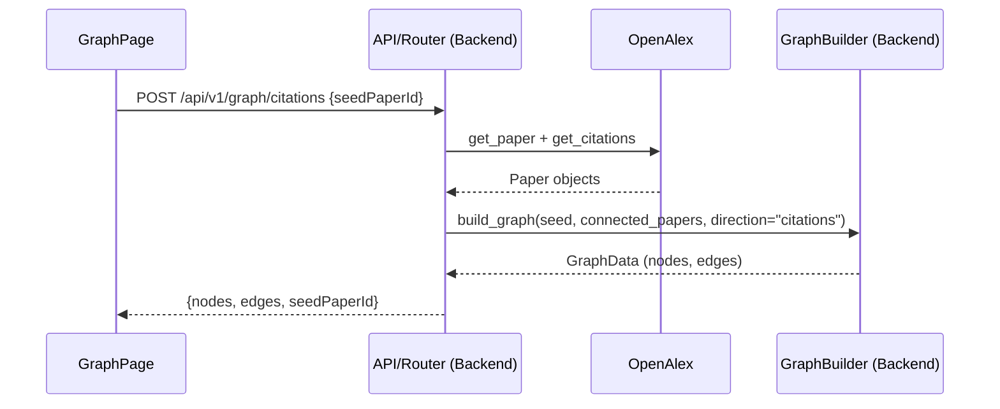

# Phase 2: Backend Goals

## Overview
Build the initial backend infrastructure for the citation graph. The backend defines the graph data structures, fetches citations and references for a seed paper, and constructs basic nodes and edges.

## Objectives

### 1. Graph Types
Add new Pydantic models to `backend/models/responses.py` for the graph data shape:

```python
class GraphNode(BaseModel):
    id: str          # paperId
    data: Paper      # full paper metadata embedded in the node
    type: str = "paper"   # matches the custom React Flow node type name

class GraphEdge(BaseModel):
    id: str          # e.g. "W123-W456"
    source: str      # paperId
    target: str      # paperId
    type: str = "citation" # or "reference"

class GraphData(BaseModel):
    nodes: list[GraphNode]
    edges: list[GraphEdge]
    seedPaperId: str
```

---

### 2. Graph Builder Service
Create `backend/services/graph_builder.py` to encapsulate graph construction:

- Accepts a seed `Paper`, a list of connected `Paper` objects, and a direction ("citations" or "references").
- Converts the `Paper` objects into `GraphNode` models.
- Builds `GraphEdge` models linking the seed node to the connected nodes based on the direction (seed → citation, reference → seed).
- Returns a `GraphData` object ready to serialize.

---

### 3. Graph Router
Add a new router `backend/routers/graph.py` with endpoints for each graph direction:

```
POST /api/v1/graph/citations
Body: { "seedPaperId": "...", "depth": 1, "limit": 60 }
```

```
POST /api/v1/graph/references
Body: { "seedPaperId": "...", "depth": 1, "limit": 60 }
```

Logic for each:
1. Fetch the seed paper via `provider.get_paper(seedPaperId)`.
2. Fetch either citations or references using the provider.
3. Pass the fetched papers to `graph_builder.build_graph(..., direction="...")`.
4. Return the resulting `GraphData`.

Register the new router in `backend/main.py`.

---

## Data Flow



---

## Definition of Done
- [ ] `POST /api/v1/graph/citations` and `/api/v1/graph/references` return valid `{ nodes, edges, seedPaperId }` for a real paper.
- [ ] `GraphData` response matches the expected format without positional data.
- [ ] Edges are correctly directed depending on the endpoint (references point to seed, seed points to citations).
