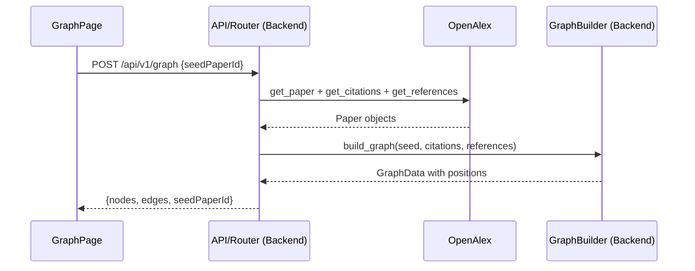

# Phase 2: Backend Goals

## Overview
Build the backend infrastructure for the citation graph. This involves defining the graph data structures, implementing the mathematical logic for a radial layout, and creating an endpoint that fetches connected papers in parallel and returns the computed graph.

## Objectives

### 1. Graph Types
Add new Pydantic models to `backend/models/responses.py` for the graph data shape:

```python
class NodePosition(BaseModel):
    x: float
    y: float

class GraphNode(BaseModel):
    id: str          # paperId
    position: NodePosition
    data: Paper      # full paper metadata embedded in the node
    type: str = "paper"   # matches the custom React Flow node type name

class GraphEdge(BaseModel):
    id: str          # e.g. "W123-W456"
    source: str      # paperId
    target: str      # paperId
    type: str = "citation"

class GraphData(BaseModel):
    nodes: list[GraphNode]
    edges: list[GraphEdge]
    seedPaperId: str
```

---

### 2. Graph Builder Service
Create `backend/services/graph_builder.py` to encapsulate layout logic:

- Accepts a seed `Paper`, a list of citation `Paper` objects, and a list of reference `Paper` objects.
- Places the seed node at `(0, 0)`.
- Distributes citation and reference nodes in concentric rings around the center using simple trigonometry.
- Builds edges: seed → each citation, each reference → seed.
- Returns a `GraphData` object ready to serialize.

**Radial layout formula:**
```python
import math

angle = (2 * math.pi * i) / total_nodes
x = radius * math.cos(angle)
y = radius * math.sin(angle)
```

---

### 3. Graph Router
Add a new router `backend/routers/graph.py` with a single endpoint:

```
POST /api/v1/graph
Body: { "seedPaperId": "...", "depth": 1, "limit": 60 }
```

Logic:
1. Fetch the seed paper via `provider.get_paper(seedPaperId)`.
2. Fetch citations and references in parallel using `asyncio.gather`.
3. Pass all papers to `graph_builder.build_graph()`.
4. Return the resulting `GraphData`.

Register the new router in `backend/main.py`.

---

## Data Flow



---

## Definition of Done
- [ ] `POST /api/v1/graph` returns valid `{ nodes, edges, seedPaperId }` for a real paper.
- [ ] `GraphData` response matches the expected React Flow format.
- [ ] Edges are correctly directed (references point to seed, seed points to citations).
- [ ] Nodes have non-overlapping `x` and `y` coordinates computed by `graph_builder.py`.