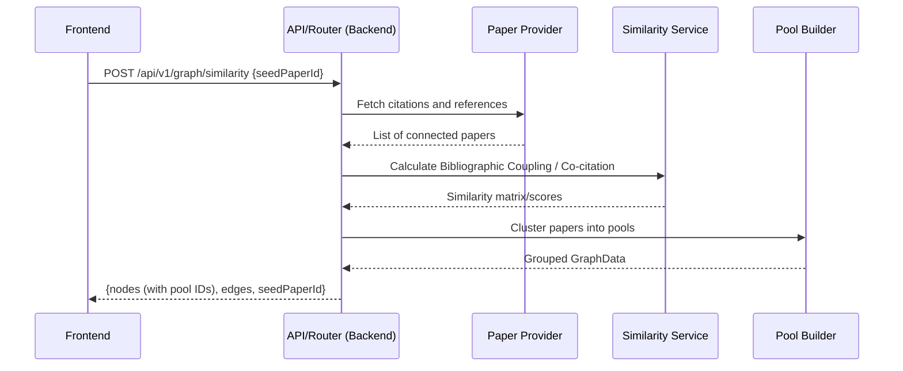

# Phase 3: Paper Pools & Similarity (Backend)

## Overview
Build out the intelligence for grouping fetched papers into coherent pools based on their similarity to one another, contextualizing how they relate to the seed paper.

## Objectives

### 1. Similarity Algorithms
Create `backend/services/similarity.py` to calculate relationships between papers:

- **Bibliographic Coupling**: Identify papers that cite the same sources. (Measures how much two papers' reference lists overlap).
- **Co-citation**: Identify papers that are frequently cited together by other papers. (Measures how often two papers appear together in other reference lists).

### 2. Paper Pools Service
Extend or create a service (`backend/services/pool_builder.py`) to process the raw citations and references fetched in Phase 2:

- For a given seed paper and its fetched connections, use the similarity algorithms to cluster papers into distinct pools (e.g., "Prior Work/Foundations", "Derivative Work", "Alternative Methods").
- Annotate the graph data structure with pool identifiers and relationships to feed into the frontend layout engine.

### 3. API Updates
Update the Graph Router (`backend/routers/graph.py`) to incorporate the paper pool logic:

- After fetching papers in Phase 2's `build_graph` logic, apply the clustering algorithms.
- Return the enhanced `GraphData` including `pools` or cluster IDs on each `GraphNode`.

---

## Data Flow

---

## Definition of Done
- [ ] `similarity.py` implements functions for Bibliographic Coupling and Co-citation.
- [ ] `pool_builder.py` correctly groups papers into distinct clusters based on similarity metrics.
- [ ] Graph endpoints return nodes annotated with their calculated pool assignments.